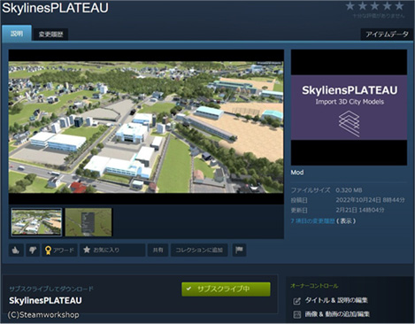
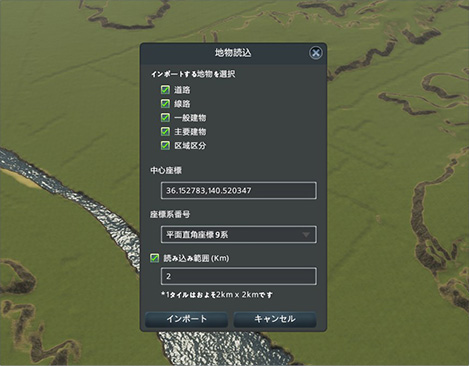

# FY2022 Project PLATEAU UC22-010「ゲーミフィケーションによる参加型まちづくり」の成果物
 

### 1.概要
PLATEAUの3D都市モデルを都市育成シミュレーションゲーム"Cities:Skylines"にインポートするMOD（SkylinesPLATEAU）のソースプログラムです。

オープンデータである3D都市モデルをゲーム内に取込み、実際の都市を再現することでビジュアライゼーションツールやまちづくりシミュレーターとして、まちづくりの計画検討やワークショップ、教育の現場等で活用することができます。
 

### 2.「ゲーミフィケーションによる参加型まちづくり」について
#### ユースケースの概要

都市計画・まちづくりの分野における自治体内部の計画検討や、市民を対象としたワークショップ、教育の現場における地域学習等においては、専門的な図面や計画図では直感的な理解が難しく、議論が深まりにくいという課題がありました。

三次元的な空間表現を用いることでわかりやすいビジュアライゼーションがこのような課題に対する解決手段となりますが、その制作や応用には専門知識や高価なソフトウェアが必要であるため、活用が進んでいないのが現状です。

本ユースケースでは、新たに開発したMODを使用して3D都市モデルを市販のゲームに取込み、都市経営シミュレーションが可能なシステムとして利用することで、市民のまちづくりへの理解・ 関心、参加意識の向上や、自治体職員の業務効率の改善に関する有用性の検証を行いました。

### 3.開発システムの概要
市販の都市のシミュレーションゲームであるCities:Skylines（以下C:S）の変更プログラムである「MOD」を活用して、3D都市モデルをゲーム内にインポートし、現実の都市を舞台にした都市経営シミュレーションができるシステムを開発しました。  

C:Sは、道路や公共施設の設置及び用途区画の設定を行い、都市を形成・成長させるゲームです。C:Sでは、MODを導入することで、ユーザー自らゲーム上で様々な機能の拡張を行うことがで可能です。  

本システムでは、主に以下の機能を提供します。
- 3D都市モデルの地形モデル（dem）の形状及び土地利用モデル（luse）の用途から地形を再現する
- 3D都市モデルの道路モデル（tran）の形状・機能から高速道路と一般道路を分類し再現する。
 - 高速道路については、ポリゴンの形状から道路中心線を算出し、その中心線に沿ってアセットを配置する。 
 - 一般道路については、高速道路と同様の処理により、幅員・道路中心線をもとにアセットの割当てを行う。
- 3D都市モデルの建築物モデル（bldg）の形状・用途・高さに応じて建築物の区画を割り当てるとともに、モデルの名称・建物IDを参照して学校や図書館等の公共施設を中心とした建物を配置できる。
- 国土地理院ベクトルタイルの鉄道の中心線・構造等を参照し、敷設位置や高架部を再現する。
- 3D都市モデルの都市計画決定情報モデル（uro）に含まれる用途地域の区分を参照してゲーム内の区画用途を割り当てる。  
※本業務では、市役所等のランドマークとなる一部の建物をテクスチャー付きのモデルとして別途作成し、アセットとして配置することで都市の再現性を高めました。  

MODの開発はC:Sを発売するParadox社が運営するWikiサイト「Cities:Skylines Wiki」の開発者向けページの仕様に従い、C#でソースコードを記述・コンパイルし、MODのdllを作成しました。また、鉄道情報の切り出しはMapboxのライブラリであるvector-tile-csを使用しています。  
詳細は[技術検証レポート](https://www.mlit.go.jp/plateau/file/libraries/doc/plateau_tech_doc_0020_ver01.pdf)を参照してください。

### 4.利用手順
#### MODの利用手順
- インポートする3D都市モデル、設定ファイルを事前に所定のフォルダに保存してください。必要なファイルや保存場所については本リポジトリの[マニュアル](Docs/Manuals/Demonstration_environment_construction_manual.pdf)をご確認ください。
- 必要に応じて、マニュアル内で使用しているMOD、アセットをサブスクライブ、有効化してください。

- Steamワークショップで公開している [SkylinesPLATEAU](https://steamcommunity.com/sharedfiles/filedetails/?id=2879201518) をサブスクライブのうえアセットエディタで有効化し、画面上のボタンから起動して使用してください。

   

<!---
  コメント：リンク先未定のためダミー
-->

#### ソースプログラムの利用手順
- MODの改変にはCities:Skylinesのインストール、ライブラリの参照が必要となります。その他、開発に関する情報はCities: Skylines Wikiの[Category:Programming](https://skylines.paradoxwikis.com/Category:Programming)を参照してください。
- Visual Studioではビルドすると"%LOCALAPPDATA%\Colossal Order\Cities_Skylines\Addons\Mods\SkylinesPlateau" にMODファイル（SkylinesPlateau.dll）が生成されようにプロジェクトを設定しています。
- 線路読込を使用する際はvector-tile-csを上記フォルダに保存してください。本リポジトリのDLLフォルダ内に複製（ファイル名：Mapbox***）があります。Mapbox.VectorTile.LICENSEの規約に従って使用してください。

### ライセンス <!-- 定型文のため変更しない -->
* ソースコードおよび関連ドキュメントの著作権は国土交通省に帰属します。
* 本ドキュメントは[Project PLATEAUのサイトポリシー](https://www.mlit.go.jp/plateau/site-policy/)（CCBY4.0および政府標準利用規約2.0）に従い提供されています。

### 注意事項 <!-- 定型文のため変更しない -->

* 本レポジトリは参考資料として提供しているものです。動作保証は行っておりません。
* 予告なく変更・削除する可能性があります。
* 本レポジトリの利用により生じた損失及び損害等について、国土交通省はいかなる責任も負わないものとします。

### 参考資料　 <!-- 各リンクは納品時に更新 -->
*  ゲーミフィケーションによる参加型まちづくり 技術検証レポート : https://www.mlit.go.jp/plateau/file/libraries/doc/plateau_tech_doc_0020_ver01.pdf
*  PLATEAU Webサイト Use caseページ「ゲーミフィケーションによる参加型まちづくり」: https://www.mlit.go.jp/plateau/use-case/uc22-011/
*  Cities: Skylines Wiki / Category:Programming : https://skylines.paradoxwikis.com/Category:Programming
*  mapbox/vector-tile-cs : https://github.com/mapbox/vector-tile-cs
*  その他の参考サイトは本リポジトリのDocsフォルダ内、参考サイト.mdに記載しております。
