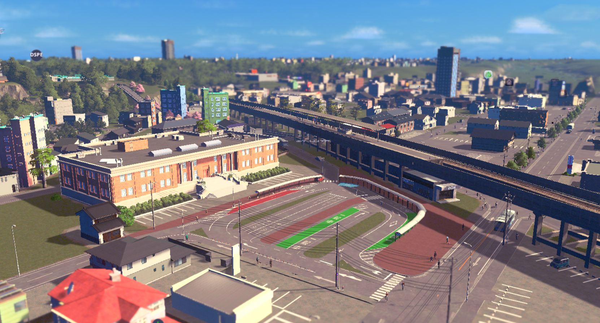

# Cities: Skylines PLATEAU MOD

### 概要
PLATEAUの3D都市モデルを都市育成シミュレーションゲーム"Cities: Skylines"にインポートするMOD（SkylinesPLATEAU）です。（ Cities: Skylines II には対応していません。）

オープンデータである3D都市モデルをCities: Skylinesのワールドデータとしてインポートすることで実際の都市を再現できます。

まちづくりシミュレータとして、まちづくりの計画検討やワークショップ、教育の現場等で活用することができます。
