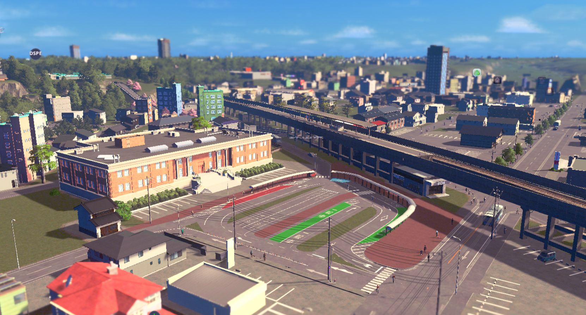
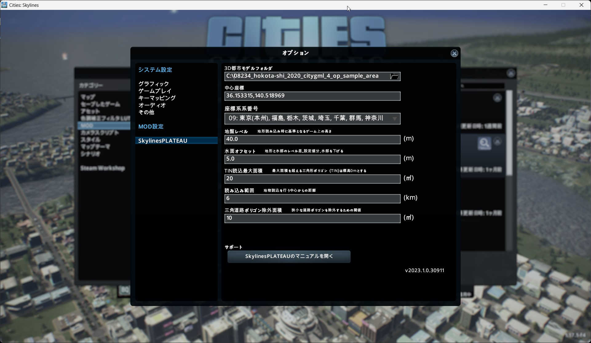

# Cities: Skylines PLATEAU MOD
 

### 更新履歴

| 更新日時               | リリース      | 更新内容                  |
| ----------------------| ---------------------- | ---------------------- |
| 2024/03/29               | **2nd Release**    |  インポートする3D都市モデルの指定や地形読込時に基準とする座標・標高等の設定各種パラメータを一つのウィンドウで実施できるようにユーザーインタフェースを改良。 事前に用意する必要があった設定ファイルを自動生成するよう改良。 |
| 2023/03/27               | **1st Release**     | |

## 1.概要
PLATEAUの3D都市モデルを都市育成シミュレーションゲーム"Cities: Skylines"にインポートするMOD（SkylinesPLATEAU）のソースプログラムです。( Cities: Skylines II には対応していません。)

オープンデータである3D都市モデルをCities: Skylinesのワールドデータとしてインポートすることで実際の都市を再現できます。

まちづくりシミュレータとして、まちづくりの計画検討やワークショップ、教育の現場等で活用することができます。
 

## 2.「ゲーミフィケーションによる参加型まちづくり v2.0」について

近年、都市計画やまちづくりの分野において、市民の意見やアイデア収集、完成イメージの共有等に3D技術を活用したワークショップ方式が用いられつつあります。他方、それらのツールの導入コストは高く、専門知識が求められることからも容易に導入することはできませんでした。

2022年度の実証実験では、「ゲーミフィケーションによる参加型まちづくり」の実現に向けて、3D都市モデルを市販のシミュレーションゲームである「Cities:Skylines」に取り込み、まちづくりのシミュレータとして利用するためのMODシステムを開発しました。今回の実証実験では、昨年度の課題等を踏まえ、同システムを更に直感的にまちづくりの検討に活用できるようにするためのバージョンアップを実施しました。加えて、本システムを活用したまちづくり検討のプロセスを体験できるワークショップを設計・開発し、実際のまちづくりの検討プロセスにおける有用性を検証しました。

## 3.利用手順
本システムの構築手順及び利用手順については[利用チュートリアル](https://186nobu.github.io/SkylinesPLATEAU/) を参照してください。

## 4.システム概要

### 【読込機能】
#### ①地形・高速道路の3D形状及び属性情報読込機能
- 3D都市モデルの地形モデル（dem）の形状及び土地利用モデル（luse）の用途から地形を再現する。
- 3D都市モデルの道路モデル（tran）の形状・機能から高速道路と一般道路を分類して再現する。
- 高速道路については、ポリゴンの形状から道路中心線を算出し、その中心線に沿ってアセットを配置する。

#### ②地物の3D形状及び属性情報読込機能
 - 一般道路については、高速道路と同様の処理により、幅員・道路中心線をもとにアセットを配置する。
- 3D都市モデルの建築物モデル（bldg）の形状・用途・高さに応じて建築物の区画を割り当てるとともに、モデルの名称・建物IDを参照して学校や図書館等の建物を配置できる。
- 国土地理院ベクトルタイルの鉄道の中心線・構造等を参照し、敷設位置や高架部を再現する。
- 3D都市モデルの都市計画決定情報モデル（uro）に含まれる用途地域の区分を参照してゲーム内の区画用途を割り当てる。  

### 【UI/UX機能】

#### ③3D都市モデル読込時のパラメータ設定機能

- オプションメニューから以下の設定が可能です。
	- 3D都市モデルフォルダ：読込み対象の3D都市モデルをPC上の任意のフォルダ位置で指定。
	- 中心座標：ゲーム内の中心座標位置を10進法の緯度経度で指定。
	- 平面直角座標系番号：読込み範囲の平面直角座標系番号をプルダウンで指定。
	- 地盤レベル：地形読込み時に基準とする海面の高さを指定。
	- 水面オフセット：水部を地表からどれだけ低くするかを指定。
	- TIN読込最大面積：読込対象とするTINの最大面積を指定。（湖沼、海面の部分には三角形ポリゴン（TIN）の頂点がなく、標高が正しく反映されないため、この部分を読込みの対象外とし、標高を0ｍとすることで湖沼、海面を再現しています。）
	- 三角道路ポリゴン除外面積：除外する狭小な道路ポリゴンの最大面積を任意の値で指定。

 

### 5.利用技術

| 種別              | 名称   | バージョン | 内容 |
| ----------------- | --------|-------------|-----------------------------|
| ミドルウェア       | [Steam®](https://store.steampowered.com/) | 1702079146 | ゲーミングプラットフォームアプリケーション |
|        | [Cities: Skylines](https://steamcommunity.com/app/255710) | | 市販の都市シミュレーションゲーム |
| ライブラリ      | [ICities](https://skylines.paradoxwikis.com/Modding_API) |  | Cities: SkylinesのMODを開発する際に使用するライブラリ |
|       | [Mapbox-vector-tile-cs](https://github.com/mapbox/vector-tile-cs) |  | Mapbox（地図開発プラットフォーム）の機能を使用するためのライブラリ |

## 6. 動作環境 <!-- 動作環境についての仕様を記載ください。 -->
| 項目               | 最小動作環境                                                                                                                                                                                                                                                                                                                                    | 推奨動作環境                   | 
| ------------------ | ----------------------------------------------------------------------------------------------------------------------------------------------------------------------------------------------------------------------------------------------------------------------------------------------------------------------------------------------- | ------------------------------ | 
| OS                 | Microsoft Windows 10、11                                                                                                                                                                                                                                                                                                                 |  同左 | 
| CPU                | Intel Core i7以上                                                                                                                                                                                                                                                                                                                               | 同左              | 
| メモリ             | 8GB以上                                                                                                                                                                                                                                                                                                                                         | 32GB以上                        | 
| GPU | NVIDIA® GeForce GTX™ 1060                                                                                                                                                                                                                                                                                                                                    |  NVIDIA® GeForce RTX™ 3050 | 
| ディスプレイ | 1280ｘ720以上                                                                                                                                                                                                                                                                                                                                    | 同左 | 
| ネットワーク       | Cities: Skylinesのアカウント認証、鉄道読込時に必要 |  同左                            | 

## 7. 本リポジトリのフォルダ構成 <!-- 本GitHub上のソースファイルの構成を記載ください。 -->
| フォルダ名 |　詳細 |
|-|-|
| Docs | マニュアル、参考サイト |
| MOD_Settings | 実証時に使用したMODの設定ファイル |
| SampleData | 読込み動作確認のための3D都市モデル（鉾田市の一部）|
| SkylinesPlateau | ソースプログラム |
| dll | 開発に必要なライブラリ |

## 8. ライセンス <!-- 変更せず、そのまま使うこと。 -->

- ソースコード及び関連ドキュメントの著作権は国土交通省に帰属します。
- 本ドキュメントは[Project PLATEAUのサイトポリシー](https://www.mlit.go.jp/plateau/site-policy/)（CCBY4.0及び政府標準利用規約2.0）に従い提供されています。

## 9. 注意事項 <!-- 変更せず、そのまま使うこと。 -->

- 本リポジトリは参考資料として提供しているものです。動作保証は行っていません。
- 本リポジトリについては予告なく変更又は削除をする可能性があります。
- 本リポジトリの利用により生じた損失及び損害等について、国土交通省はいかなる責任も負わないものとします。

## 10. 参考資料 <!-- 技術検証レポートのURLはアクセンチュアにて記載します。 -->
- 技術検証レポート: https://xxxx
- PLATEAU WebサイトのUse Caseページ「ゲーミフィケーションによる参加型まちづくり v2.0」: https://www.mlit.go.jp/plateau/use-case/uc23-12/
- Cities: Skylines Wiki / Category:Programming : https://skylines.paradoxwikis.com/Category:Programming
- mapbox/vector-tile-cs : https://github.com/mapbox/vector-tile-cs
- その他の参考サイトは、本リポジトリのDocsフォルダ内の参考サイト.mdに記載しています。

