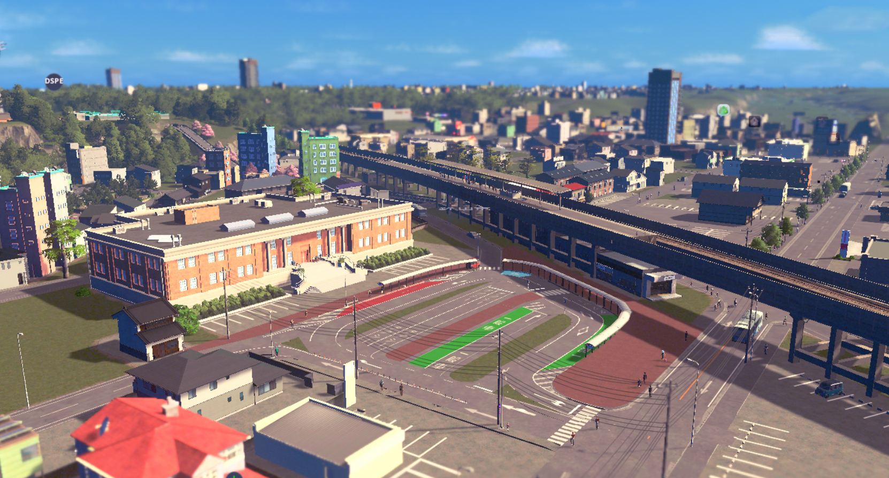

# Cities: Skylines PLATEAU MOD

PLATEAUの3D都市モデルを都市育成シミュレーションゲーム"Cities: Skylines"にインポートするMOD（SkylinesPLATEAU）です。（ Cities: Skylines II には対応していません。）

オープンデータである3D都市モデルをゲーム内に取り込み、実際の都市を再現することで、ビジュアライゼーションツールやまちづくりシミュレータとして、まちづくりの計画検討やワークショップ、教育の現場等で活用することができます。

<!-- 
更新確認　20240318

markdown フォルダ内の .md 画像を変更する
変更後、docfx build markdown\docfx.jsonを実行し、htmlファイルを生成する

以下を実行してローカルで確認可
docfx markdown\docfx.json --serve

-->
