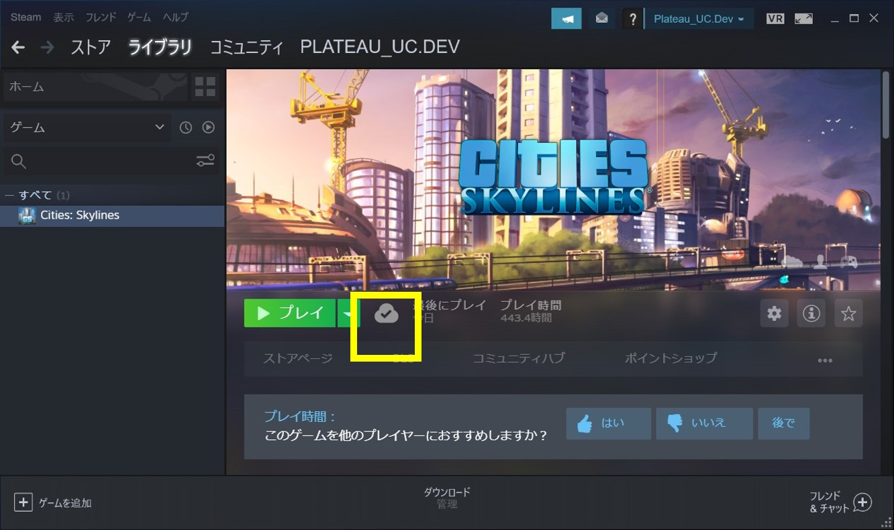
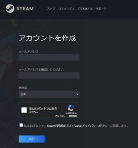
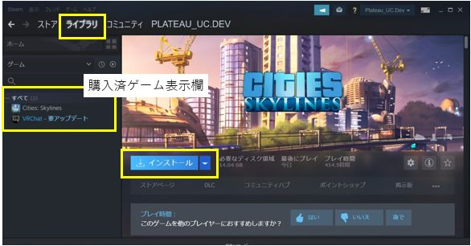
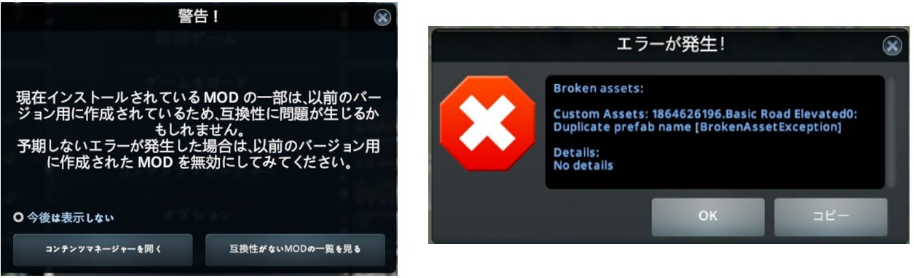

## 1. Cities Skylinesのインストール

------

### 1.1 PCの準備

推奨スペックの条件を満たすPC環境を準備してください。

SkylinesPLATEAUを使用したゲーム環境の推奨スペック（動作確認環境）は以下のとおりです。

- Windows10　64ビット版
- CPU intel Core i7-9700以上　 
- メモリー　32GB以上
- インターネット接続環境
- Steamアプリがオンラインモード

<!-- Steamアプリ画面 -->

 
 

### 1.2 Steamアカウントの作成とSteamアプリのインストール

初めてSteamを利用する場合はアカウント作成とログインを行い、Steamアプリをインストールしてください。

① Steamウェブサイトでアカウントを作成し、ログインします。 https://store.steampowered.com/join/
<!--
 
アカウント作成画面  -->

 
 
 

② Steamアプリをインストールします。
https://store.steampowered.com/about/

### 1.3 Cities: Skylinesの購入とインストール

初めてCities: Skylinesを利用する場合はPC版Cities: Skylinesの購入とインストールを行ってください。

① Steamウェブサイト＞ストアからCities: Skylinesを購入します。
　　https://store.steampowered.com/app/255710/Cities_Skylines/
<!--
Steamウェブサイト、購入画面  -->

 
 
 

② Steamアプリ＞ライブラリ画面左欄の「Cities: Skylines」をクリックします。

③ 「インストール」ボタンをクリックしてインストールを実行します。（インストール時の設定は特に理由がない場合は初期値のままとしてください。）

<!--
Steamアプリ（ライブラリ）画面、インストールボタン   -->

 
 

### 1.4 注意点

- 3D都市モデルの整備時期、整備内容により、インポート時の精度が低下する可能性があります。

- アプリのアップデートにより、マップエディタやゲームを開く際にMOD、アセットに関するエラーが表示されることがありますが、通常は「OK」ボタンで操作を実行してください。ゲームの動作に支障をきたす場合は、表示された内容を確認しMOD、アセットのサブスクライブ解除等の措置を実施してください。

- 既存MODの設定の上書き操作が含まれるため、必要に応じて事前にバックアップを行ってください。

- Cities: Skylinesのインストール時に、初回起動はローカルファイルの生成のため、時間がかかることがあります。

- 企業や学校等のプロキシ環境でログインやアプリの更新ができない場合はネットワーク管理者の方に相談してください。

<!--
エラー表示例   -->

 
 
