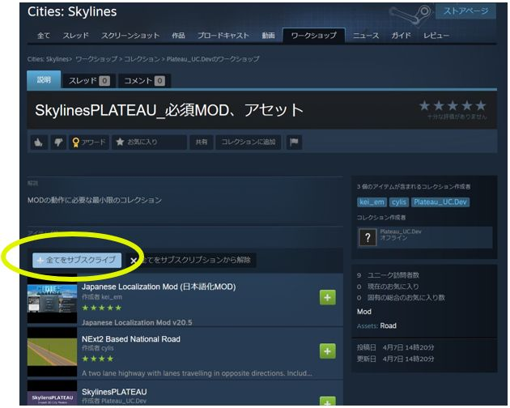
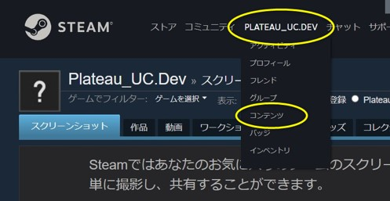
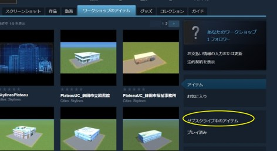
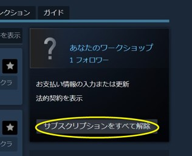

## 2.  SkylinesPLATEAUの導入

------

### 2.1 SkylinesPLATEAU及び、必須MOD・アセットの導入

SkylinesPLATEAU及び必須MOD・アセットを導入するため、Steamのサイトからサブスクライブしてください。

Cities: SkylinesではMODによるUIの日本語化と高速道路（対向2車線）のアセットが必要となります。

① [SkylinesPLATEAU_必須MOD、アセット](https://steamcommunity.com/sharedfiles/filedetails/?id=2958742103)<!--（※URLは今後変更予定）-->をブラウザで開きます。

② 「+全てをサブスクライブ」ボタンをクリックします。

<!--
#### ※正式リリースまでは [β版](https://steamcommunity.com/sharedfiles/filedetails/?id=3114277872) を別途サブスクライブしてください
-->

<!--
「+全てをサブスクライブ」ボタン   -->

 
 
必須MOD・アセットの内容

|コレクション上の表示名	|内容|
|-------------------|-------------------|
|SkylinesPLATEAU	|3D都市モデルをインポートするためのMOD|
Japanese Localization Mod   （日本語化MOD）	|UIを日本語化するためのMOD|
|NExt2 Based National Road	|高速道路（対向2車線）のアセット|

 
 

### （参考）サブスクリプションの解除

既にサブスクライブしているMOD同士の干渉回避が必要な場合やコレクション「SkylinesPLATEAU_必須MOD、アセット」を更新する必要がある場合には、サブスクリプションをすべて解除した後、必要なMOD、アセットのサブスクライブを行ってください。

① Steamサイト又はSteamアプリ上部のユーザー名をクリックし、その後表示される「コンテンツ」をクリックします。

 
 
 

② 「ワークショップのアイテム」タブから右下の「サブスクライブ中のアイテム」をクリックします。

 
 
 

③ 「サブスクリプションをすべて解除」をクリックします。

