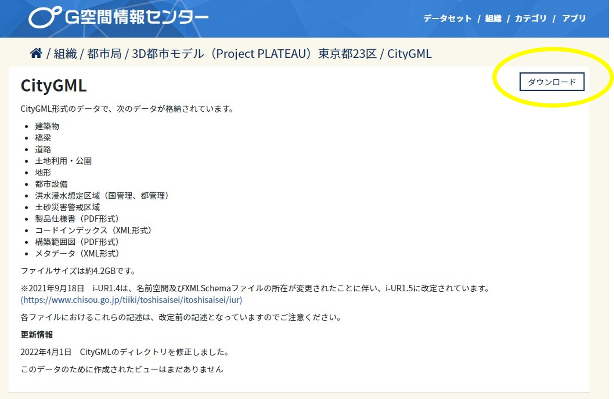
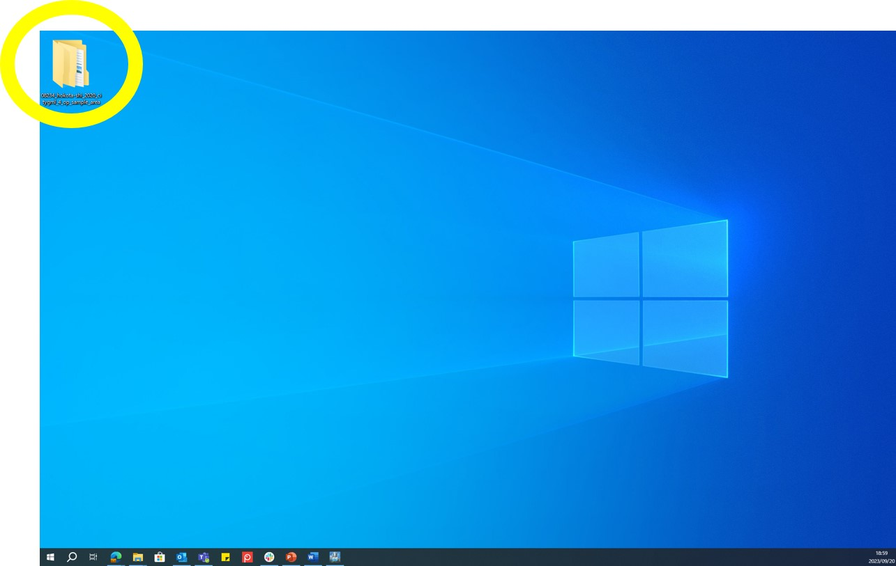
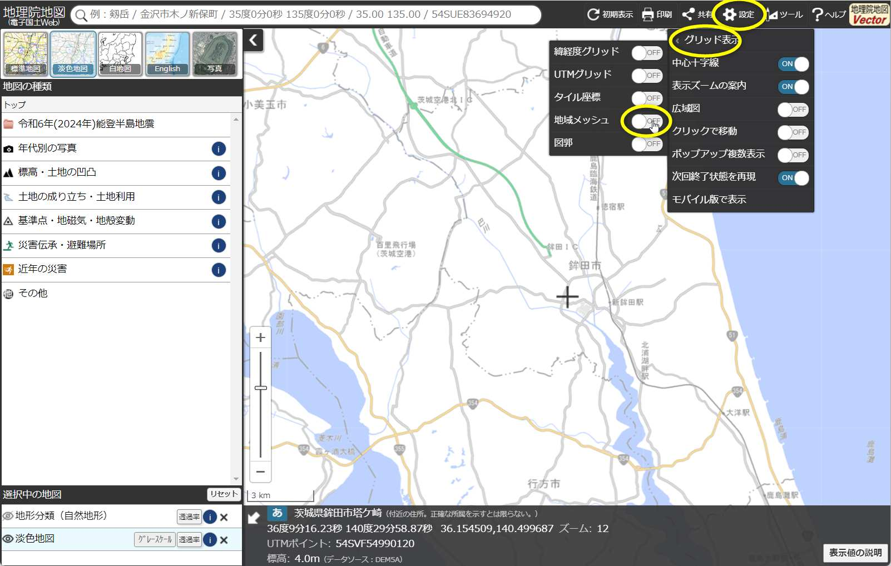
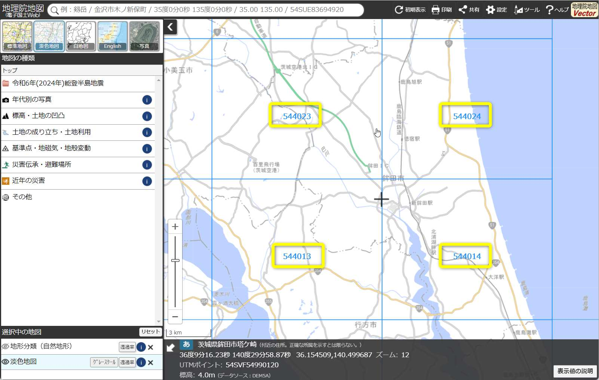
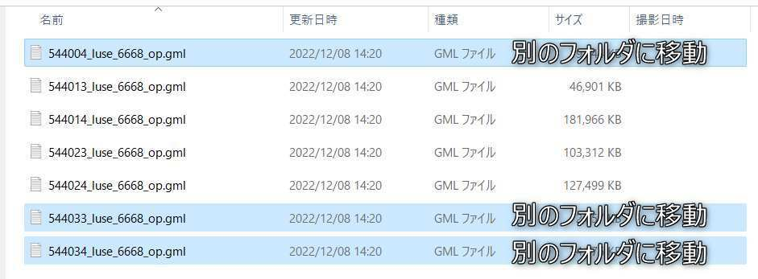

## 2. 3D都市モデルのダウンロード

------

ゲーム上に再現したい都市の3D都市モデルをダウンロード（※1）し、任意（デスクトップ等）の場所に保存してください。

① G空間情報センターの3D都市モデル（Project PLATEAU）ポータルサイト（ https://www.geospatial.jp/ckan/dataset/plateau ）をブラウザで開きます。

 
 
 

② リンクから任意の都市のデータセットページに進み、データ欄の「CityGML」をクリックします。

 
 
 

③ CityGMLのページで「ダウンロード」ボタンをクリックしてファイルをダウンロードし、Zipファイルを展開します（任意の場所に保存します）。

 
 

※1 サンプルデータ（茨城県鉾田市の3D都市モデルの一部データ）を使用する場合は
https://github.com/Project-PLATEAU/SkylinesPLATEAU/blob/main/SampleData/08234_hokota-shi_2020_citygml_4_op_sample_area.zip をダウンロードします。

 

#### 参考

展開したフォルダ内のファイル数が多い場合、MODでの読み込み処理に時間がかかることがあります。

このため、不要なエリアのファイルを別のフォルダに移動して複数回に分けて読み込むなどの対応を行ってください。

各地物のフォルダ内のファイル名は地域メッシュ番号と対応しているため、読み込み範囲の地域メッシュ番号を確認して地域メッシュ番号と同じファイル名のファイルを残し、その他のファイルを別のフォルダに移動します。

 ① 地理院地図（ http://maps.gsi.go.jp/ ）等で読み込みたい範囲の地域メッシュ番号を確認します。

 - 地理院地図をブラウザで表示します
 -  設定をクリックします
 -  グリッド表示をクリックします
 -  地域メッシュをONにします

 
 

 - 第２次地域区画（6桁）また第３次地域区画（8桁）の地域メッシュ番号を確認してください

 
 

 
 ② 読み込みたい範囲以外のファイルを別のフォルダに移動します。
 
- 3D都市モデルフォルダ\udx 内に各地物のフォルダがあり、その中に地域メッシュごとのファイルが保存されています。
- ファイル名の先頭が地域メッシュ番号になっています。
- 読み込み範囲のファイルを残し、その他のファイルを別のフォルダに移動してください。

鉾田市、luse（土地利用）フォルダの例
 
 

