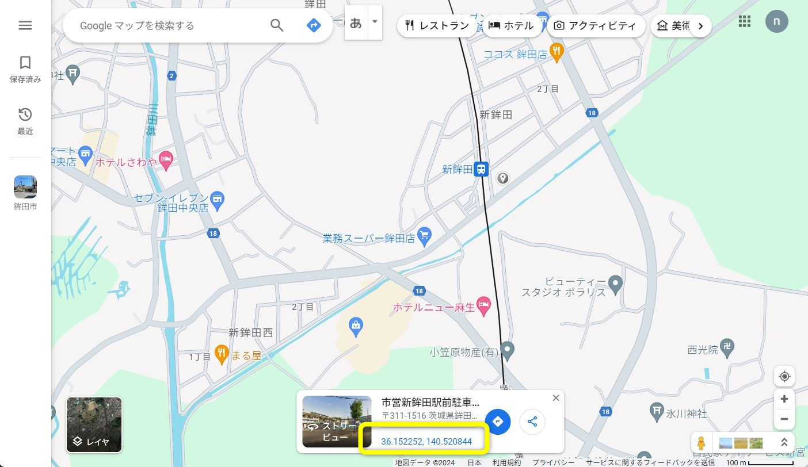

## 3. 中心座標の確認

------

3D都市モデルをインポートする際に必要な読込み位置の中心点の経緯度を確認し、値をコピーしてください。

緯度経度には十進経緯度（１０進法）と度分秒（６０進法）での表記方法があり、SkylinesPLATEAUでは十進経緯度（１０進法）を中心座標として使用します。

以下の方法のいずれでも十進経緯度（１０進法）で表示されているため、コピーした値をそのままSkylinesPLATEAUの中心座標として使用できます。

① 3D都市モデルの読込みを行うエリアの中心座標をPLATEAU VIEW （※1）やGoogleマップ（※2）、地理院地図（※3）で確認し、コピーします。

##### ※1 PLATEAU VIEW（ https://plateauview.mlit.go.jp/ ）

- 緯度経度の取得方法

    - マウスカーソルの位置の緯度経度を取得できます （固定されないので、確認時にマウスを動かさないように注意が必要です）

- 特徴

    - 3D都市モデルの有無やモデル化された建物の分布を確認しながら探索できます

 
 
 

##### ※2 Google map（ https://www.google.com/maps?authuser=0 ）

- 緯度経度の取得方法

    - クリックした位置の緯度経度を取得できます

- 特徴

    - 住所、地名、施設名、カテゴリ等で検索可能です

 

##### ※3 地理院地図（ http://maps.gsi.go.jp/ ）

- 緯度経度の取得方法

    - 画面の中心点の緯度経度が取得できます

- 特徴

    - 住所、地名、施設名等で検索可能です

