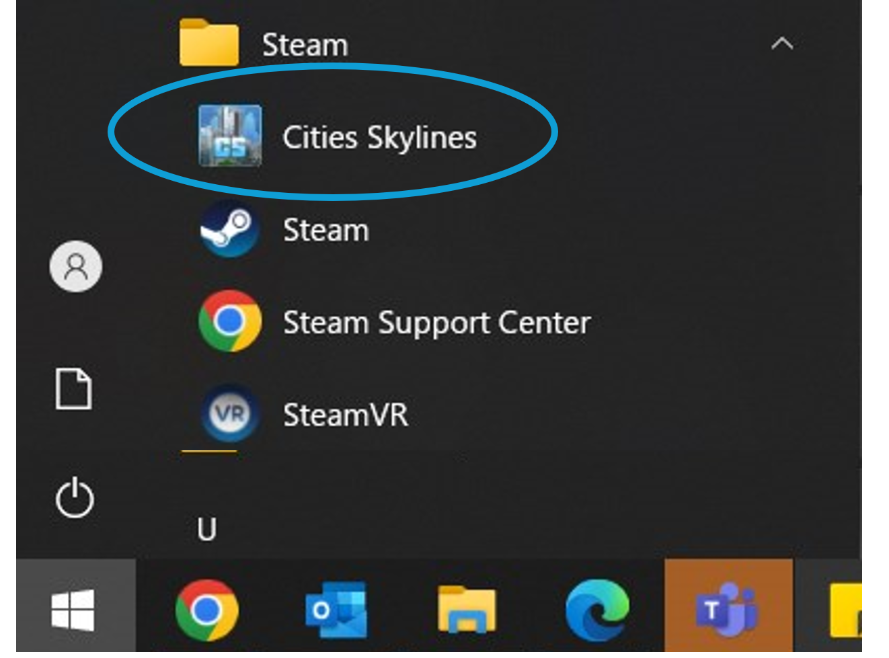
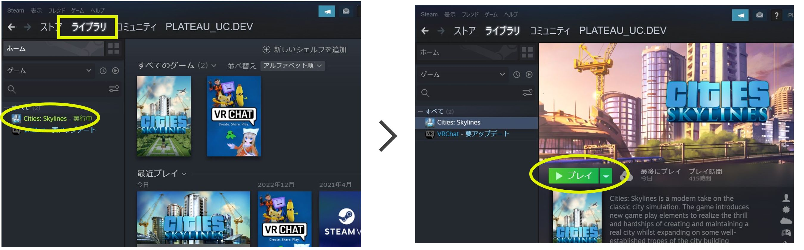
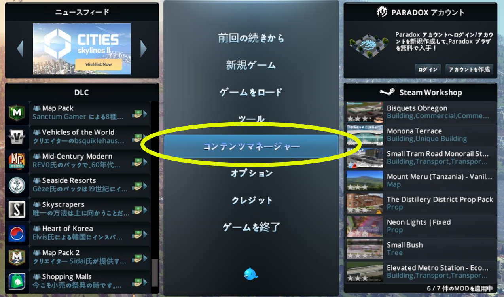
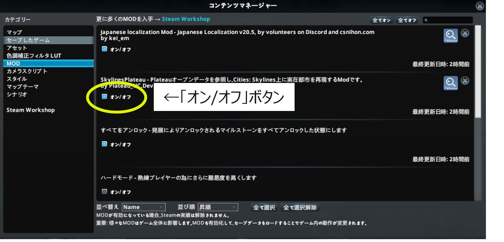
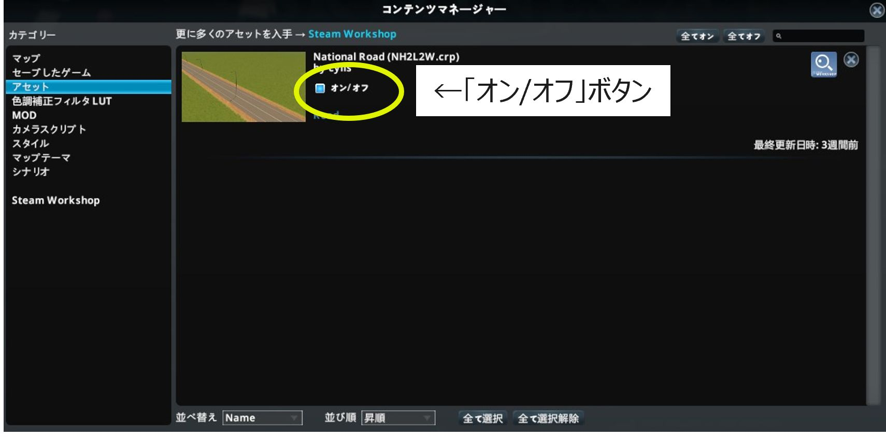

## 4. Cities Skylinesの起動と設定

------

### 4.1 Paradoxランチャーの起動

Cities: Skylinesの起動のため、「Paradoxランチャー」を起動してください。

【方法1　デスクトップショートカット、スタートメニューから起動】

- デスクトップのショートカット、又は、
- Windowsのスタートメニュー＞Steam＞Cities Skylinesを選択します。

 

  

【方法2　Steamアプリから起動】

① Steamアプリ＞ライブラリ画面左欄の「Cities: Skylines」をクリックします。

② 「▶プレイ」ボタンをクリックします。

 

  

### 4.2 Cities: Skylinesの起動

ParadoxランチャーからCities: Skylinesを起動してください。

① ランチャー画面左欄で「Cities: Skylines」をクリックします。

② ランチャー画面右上の言語選択で「日本語」を選択します。（他言語が表示されている場合のみ）

 ③ 「プレイ」ボタンをクリックします。

 

  

### 4.3 UIの日本語化

メインメニューが日本語以外で表示されている場合は日本語表示への変更を行ってください。

① メインメニューで「OPTIONS」をクリックし、設定ウィンドウを表示します。

② ウィンドウ左側の「GAMEPLAY」を選択し、「Language settings」欄で「日本語（JAPANESE）」を選択します。

※ 選択欄に「日本語（JAPANESE）」が表示されない場合は、MODの有効化後にCities: Skylinesを再起動し、上記の操作を行います。

 

  

### 4.4 サブスクライブしたMOD、アセットと標準MODの有効化

① メインメニューで「コンテンツマネージャー」を選択し、コンテマネージャーを起動します。

 

  

② コンテンツマネージャー画面左側の「カテゴリー」欄で「MOD」を選択します。

③ 「オン/オフ」ボタンをクリックし、ハードモードを除く全てのMODを有効化します。 （オンの状態とします）

 

  

④ コンテンツマネージャー画面左側の「カテゴリー」欄で「アセット」を選択します。

⑤ 「National Road」を有効化します。

 

  

### 4.5 参考資料（有効化するMOD、アセット一覧）

 

| コンテンツマネージャー上の表示名|内容	|備考|
|--------------------------------|-------------------------------|-----------------------------|
| National Road              	|高速道路（対向2車線）のアセット	|カスタムアセット|
|SkylinesPLATEAU2023	|PLATEAUの3D都市モデルをインポートするための令和5年度開発MOD	|カスタムMOD|
|Japanese Localization Mod |UIを日本語化するためのMOD	|カスタムMOD|
|土砂無限	|地形操作時に、土砂の残量による制限がなくなる	|標準MOD|
|すべてをアンロック	|発展によりアンロックされるマイルストーンをすべてアンロックした状態にする	|標準MOD|
|地下資源無限	|マップ上の原油と鉱石が減少しなくなる	|標準MOD|
|資金無限	|資金が底を突かなくなる	|標準MOD|

  
