## 6. マップデータ作成

------

ゲーム開始時に必要となる地形、高速道路、水源を設定したマップデータの作成を行ってください。（以下では、座標値等はサンプルファイルを例としたものです。）

### 6.1 新規マップ作成

マップエディタで使用する新規マップの作成を行います。

  ① メインメニューで「ツール」をクリックします。

  ② 「ツール選択」でマップエディタ欄の「新規」ボタンをクリックします。

  ③ 「新規マップ」ウィンドウのテーマを選択欄で「温帯」を選択し、「左側通行」ボタンをクリックしてオン（青色に点灯）の状態として「作成」ボタンをクリックします。

 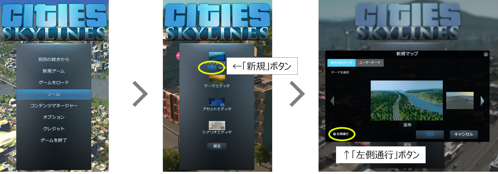

  

### 6.2 地形・高速道路の読込み

  SkylinesPLATEAUの「地形、高速道路読込」機能を使用して、地形と高速道路の読込みを行います。

  ① マップエディタ上の「地形、高速道路読込」ボタンをクリックし、ダイアログを起動します。

  ② 読込みを行う地物（地形・高速道路）を選択します。オプション画面で入力した設定値を確認し、インポートボタンを選択します。

 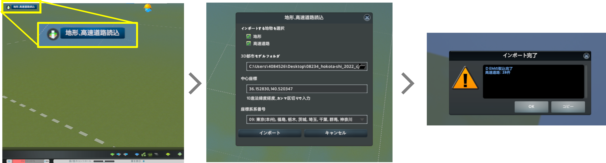

  

　注意点

 - データがない部分は標高0ｍとなります。
 - 高速道路が存在しないエリアの場合は、「細部の調整」の項に従って、高速道路の敷設を行ってください。

 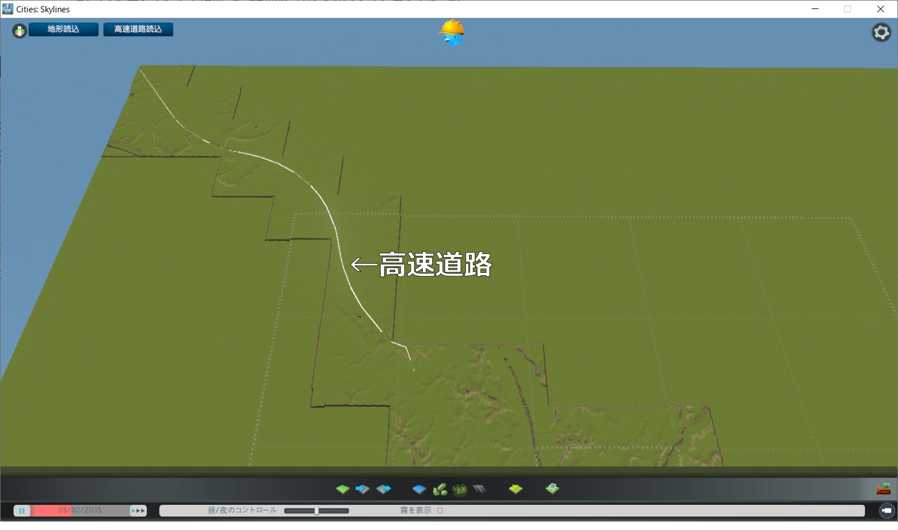

  

### 6.3 海水面の設定

Cities: Skylinesの基本機能である「水」ツールを使用して、海水面の設定を行ってください。

① マップエディタ画面下部の「水」ツールボタンをクリックし、上部に表示される「海水面を変更」をクリックします。

② 「海水面」設定ウィンドウで 「海水面高さ」に「0（m）」を入力し、「再開」ボタン又は「時間の速さ」ボタンをクリックして時間を進めます。

③ その後すぐに、「海水面高さ」に「40（m）」（※1）程度の数値を入力し、「水位を海水面に戻す」ボタンをクリックします。 （この操作により、水位が安定するまでの時間を大幅に短縮することができます。）

 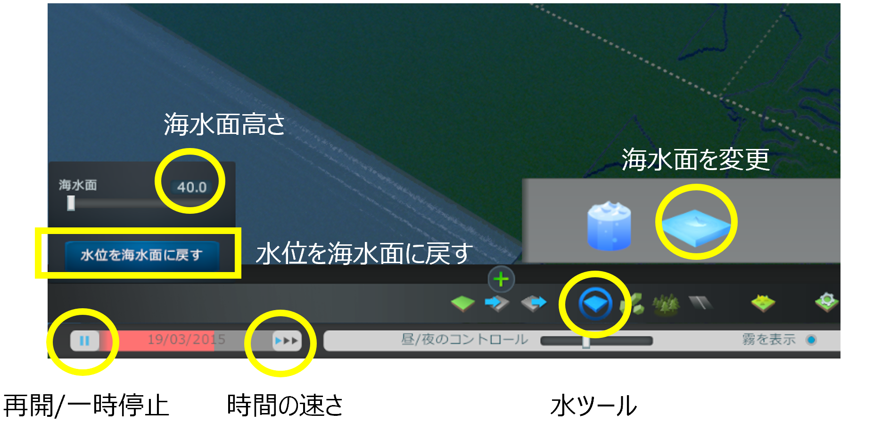  

④ 水位が安定したら「水」ツールボタンをクリックして「水」ツールを終了し、「一時停止」ボタンをクリックして時間の進行を止めます。

※1 Cities: Skylinesの水位のデフォルト値である40ｍに適合するようSkylinesPLATEAUでは地形読込の際に標高の補正を行っています。

 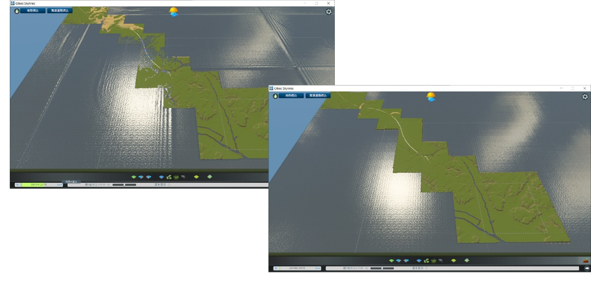  

  

### 6.4 細部の調整

マップデータをゲームで使用する場合は、以下の必須事項が定められています。

- 開始タイルに河川（水源）がある。
- 最低一つの地域内へ向かう高速道路がつながっている。
- 最低一つの地域外へ向かう高速道路がつながっている。

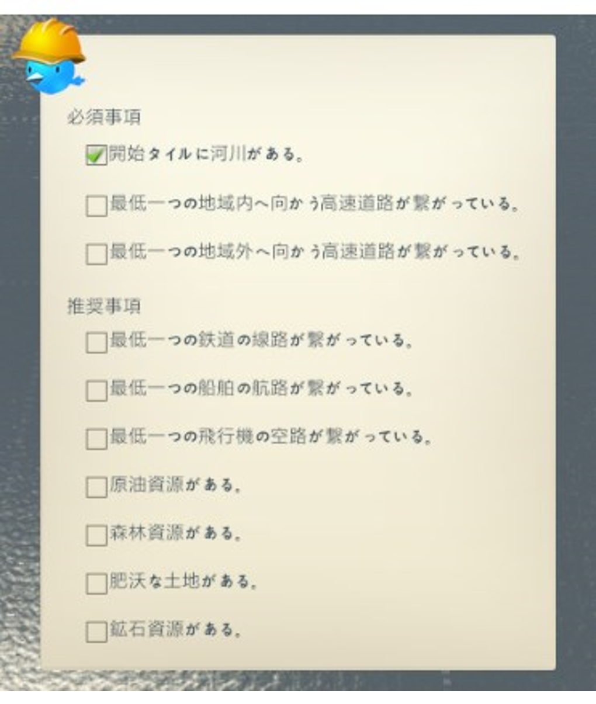 

 

このため、上記の必須事項をクリアするための操作を含めた細部の調整を行ってください。

　6.4.1 高速道路を敷設（3D都市モデルの範囲に高速道路が存在しない場合のみ）

　6.4.2 高速道路の地域外エリアとの接続

　6.4.3 水際等の地形の調整

 

#### 6.4.1 高速道路の敷設（3D都市モデルの範囲に高速道路が存在しない場合のみ）

①「道路」ツールボタンをクリックしてツールを起動します。

② 上部に表示されるウィンドウから任意の高速道路を選択します。

③ 「直線敷設」又は「曲線敷設」を選択します。

 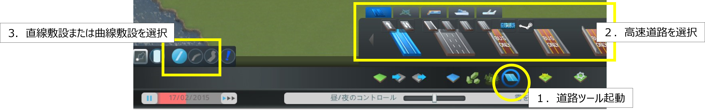

  

④ 高速道路の始点となる位置をクリックします。

⑤ 高速道路の終点となる位置をクリックします。

⑥ ④と⑤の操作を繰り返して必要な箇所に高速道路を敷設します。

 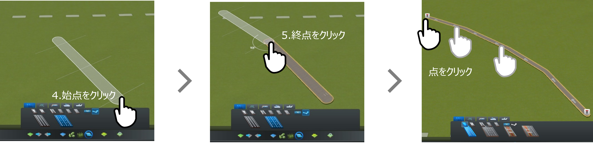

  
#### 6.4.2 高速道路の地域外エリアとの接続

①「道路」ツールボタンをクリックしてツールを起動します。

② 上部に表示されるウィンドウから「ランプ」を選択します。

③ 「直線敷設」又は「曲線敷設」を選択します。

④ 高速道路の終点をクリックした後、地域外の点をクリックして、地域外に向かう高速道路を敷設します。

⑤ ④の手順とは逆に、地域外をクリックした後、高速道路の終点をクリックして、地域内に向かう高速道路を敷設します。

 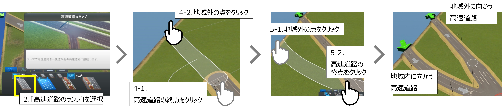

  

#### 6.4.3 水際等の地形の調整

① 「地形」ツールボタンをクリックしてツールを起動します。

② 上部に表示されるウィンドウから操作方法を選択します。
    （マウスカーソルを合わせることで詳しい操作方法、内容が表示されます。）

 

  

③ 画面左側のブラシ設定ウィンドウでブラシの硬さを設定します。値は「0.01」程度を目安に設定します。

④ 変更したい部分をクリック又はドラッグして、地形の高さの調整を行います。

 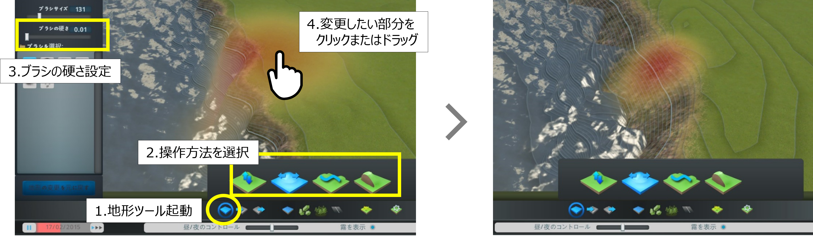

 
 

### 6.5 マップデータの保存

前項までの作業を行ったデータをマップデータとして保存し、ゲーム開始時に選択可能な状態としてください。

　① 画面右上の「メニュー」ボタンをクリックして「ポーズ」ウィンドウを表示します。

　② 「ポーズ」ウィンドウで「マップをセーブ」ボタンをクリックします。

　③ 「マップをセーブ」ウィンドウでファイル名、マップ名を入力し、「新規ゲームパネルへマップを追加」を有効化した後、「セーブ」ボタンをクリックします。 （ファイル名とマップ名は同一のものにすることを推奨します。）

　④ 「ポーズ」ウィンドウで「終了」をクリックし、「ゲームを終了」ウィンドウで「メインメニューへ」をクリックします。
 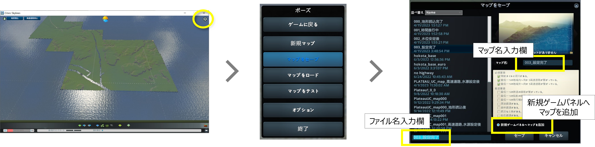

  
