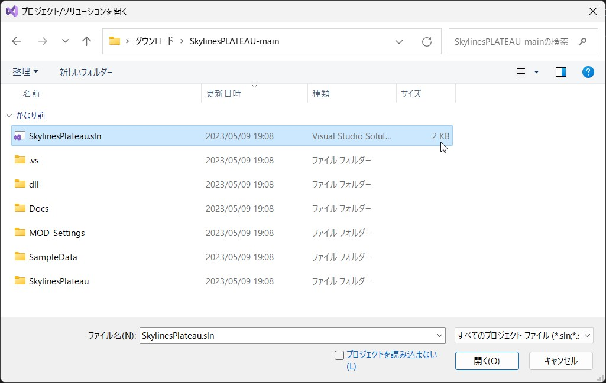
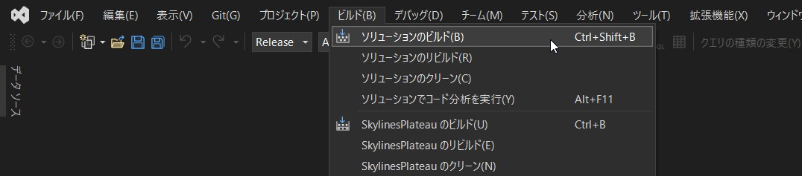

## 本MODのビルド方法

-------

### 1. ビルドに必要なツール

Microsoft Visual Studio（以下「Visual Studio」という。開発時はVisual Studio Professional 2022を使用します。）

### 2. ビルド手順

① ソースファイルをダウンロードし、展開します。

&emsp;ソースファイルは[こちら](https://github.com/Project-PLATEAU/SkylinesPLATEAU)からダウンロード可能です。

 

② SkylinesPLATEAU-mainフォルダに保存されているソリューションファイル（SkylinesPlateau.sln）をVisual Studioで開きます。

 

③ソリューション構成を【Release】に、ソリューションプラットフォームを【Any CPU】に設定します。

 

④ 「ビルド」メニュー＞「ソリューションのビルド」を選択し、ソリューション全体をビルドします。

 

⑤ ビルドが正常に終了すると、SkylinesPlateau\bin\\ReleaseフォルダにMODファイルが生成されます。（本MODの動作に必要なライブラリも同じフォルダにコピーされます。）